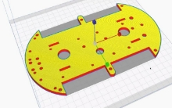

**Chapter 1: Introduction**

1. **Project Overview**

The Internet of Things (IoT) focuses on the physical devices that are equipped with sensors, processing power, software, and other technologies, and that communicate with other devices and systems over the Internet or other communication networks.

An unmanned ground vehicle is one which functions while in touch with the ground but without the presence of a human on board. Unmanned ground vehicles (UGV) can be employed in a variety of situations when having a human operator present is inconvenient, dangerous, or impossible.

The  project focuses on the following objectives:

- Remotely control UGV over the internet
- Live stream from the UGV
- Attain serialization between Raspberry Pi and Ardiuno
- Store and analyse sensor data
- Semi automate the UGV
- Create a web application to control the UGV

1. **Application Specification**

1. **Functional Requirements**

1. **Motion Control:**

An Application is designed and linked to Raspberry Pi which uses TCP/IP to send and receive communication blocks that allow the devices to talk to each other over Wi-Fi. We establish the connection between different devices and a Raspberry Pi by providing the Internet Protocol (IP) address of Pi to the application. The Pi communicates through wires, the commands to the Arduino Uno, that are connected to the motors moving the wheels

1. **Cloud Data Storage:**

Data that is collected from different sensors such as gyroscope, ultrasonic sensor, air quality sensors etc. needs to be stored for further processing and training of algorithms. Firebase IoT core is used to store and analyse this data.  Raspberry Pi is used to communicate with the Firebase cloud storage using Python programming language.

1. **Different Control Modes:**

The UGV has two different modes. The manual mode is executed using a controller interface (web application) integrated with a live stream. Manual mode is activated when the vehicle is connected to a reliable network. In case of network failure, the vehicle stops to avoid damages. The semi-automatic mode is executed by clicking a button on the web application. The UGV, with object avoidance, continues to move forward without any human assistance.

1. **Live Stream**

The camera Module integrated with the Raspberry Pi feeds videos (or images as frames)to provide a live stream on the web application.

1. **Serialization**

Serial communication is a type of communication which sends and receives data via a one or two transmission line system, with data being transmitted and received one bit at a time. Serialization of the Pi and Uno is an important feature that allows you to get the most out of both boards.

**Figure 1.2.1 Serialization Demonstration**

1. **Non-Functional Requirements**

1. **Performance and Scalability**

Under a given workload, performance refers to how quickly a software system or a specific portion of it responds to certain user inputs. In most cases, this metric explains how much a user must wait before the target operation happens (the results, motion sensor is activated, UGV movement etc.) given the sensitivity of the components (camera, gyroscope, hobby motors etc.) used. Scalability assesses the highest workloads under which the system will still meet the performance requirements. Raspberry Pi has a strong processing performance which ensures good results on all fronts. Moreover, using cloud services to store data enables us to scale the system. Moreover, Arduino Uno is highly compatible with motors improving the performance.

1. **Portability and Compatibility**

The term "portability" refers to how a system or its components may be launched in a different environment. Hardware, software, and other platform specifications are frequently included. Compatibility is an extra feature of portability. Compatibility refers to the ability of one system to coexist with another in the same environment. The vehicle's modest and compact design allows it to be operated in inaccessible areas on the same network and can be easily controlled over a simple web application.

1. **Security**

This non-functional criterion ensures that any data stored within the system or its components is safe from virus assaults and unauthorised access. Basic security is achieved by transferring data using common protocols such as TCP/IP and data is securely stored on the Google Firebase platform.

1. **Reliability**

This quality feature defines how probable it is that the system or its component will operate without failure for a certain amount of time under pre-set conditions. The Raspberry Pi is linked to the Firebase IoT core for data storage and processing, which ensures a stable connection. The Pi and Uno wired connections are 100% reliable.

1. **Usability**

Usability is yet another classical non-functional requirement that addresses a simple question: How hard is it to use the product? 

The UGV  has a simple design and can be deployed for a variety of applications like air quality monitoring, road diagnosis etc. The simple, clean web application makes it easy to control the rover and the graphs help analyse the sensor data through visualisations.

1. **Supported Operating System**

   1. Raspberry Pi OS 

   2. Raspberry Pi OS Lite 

   3. RISC OS Pi etc. 

1. **Hardware Requirements**

Raspberry Pi, Arduino Uno, Camera, Gyroscope, Breadboard, Jumper Wires (MF, MM and FF), Multi-meter, Display Screen, HDMI Cord, Micro USB, Keyboard, Mouse, DC Motor, GPS, Sensor, Ultrasonic Sensor, Servo Motor, Density, Humidity and Temperature sensor, Air Quality sensor etc.

2. **Software Requirements**
   Arduino IDE
   Python
   Google Firebase
   HTML
   CSS
   Javascript
   C++

3. **Compatibility Requirements**

PC: Windows® operating system, versions 10 Build 10240 or higher 

MAC®: Mac OS X® 10.5 or higher

Firebase Version 8.8.0

Python Version: 3.9 

Pip Version: 21.1.2

C++: 14

**Chapter 2: METHODS IMPLEMENTED**

   1. **Proposed Algorithm**

The project uses algorithms from various domains like Object Detection, Object Avoidance and Networking and Connectivity.

1. **Obstacle Avoidance**

The problem of accomplishing some control target while adhering to non-intersection or non-collision position restrictions is known as object avoidance. It is distinguished from route planning in that the former is often implemented as a reactive control rule, whilst the latter requires the pre-computation of an obstacle-free path along which a controller would then lead a robot. To attain semi-automation, Python code is used. Object avoidance is attained using 3 ultrasonic sensors.

1. **Networking and Connectivity**

Networking and connectivity forms a very important aspect of the project as the unmanned vehicle would require functional internet connectivity and a stabilised network at all times.

Optimal Mobile Sink Selection Algorithm (OMSS):

 1. It is always striving to improve network stability and, as a result, reduce the frequency of topology reconfiguration in a regulated manner.

 2. It can compute a value known as the Connection Expiration Time (CET). CET is the amount of time that a sensor node may be reliably connected.

1. **Architecture Diagrams**

**Figure 4.2 Architecture Diagram**

1. **Design Diagram**

Fig. 4.3.1 tells us about the connections on the motor shield which is connected on the Arduino Uno. There are 4 motors which will help the Unmanned Ground Vehicle to move and an extra servo motor connection. This is also powered by a 5 to 9 volt battery with an on-off switch.

**Figure 4.3.1 Arduino Design Diagram**

The Fig. 4.3.2 tells us about the connections on the Raspberry Pi, there are 3 sensors connected on the board. A Gyroscope, ultrasonic sensor and a Pi Camera are connected on the board.

**Figure 4.3.2 Rover Design Diagram**

**Chapter 3: DISCUSSION**

   1. **Software Implementation**
      1. **Web Application**

The web application displays the following modules:

- **Data Module:** The data module displays the data collected from  various sensors on the rover. Data from the sensor is gathered by the Raspberry Pi and sent to a cloud database. The cloud database  sends the data back to the website. Sensors that display data include air quality sensors, ultrasonic sensors, and temperature and humidity sensors. The air quality sensor captures the current air quality around you, and the ultrasonic sensor displays the distance between the  objects closest to the rover. Temperature and humidity sensors are used to detect local humidity and temperature.
- **Distance Module:** The display module helps users navigate the rover  by displaying live feeds from the Pi camera attached to the rover. The live feed is captured by a Pi camera and  sent to the Raspberry Pi. Raspberry Pi renders it into an HTML page. Live streams are displayed in this module with an i-frame tag that embeds a local HTML page in the Pi module responsible for the live feed. This live stream is only  possible if the system is connected to a Pi module on your local network.
- **Utility Module:** The utility module has two buttons. One is for displaying charts and the other is for enabling or disabling the semi-automatic mode of the rover. The data collected by the sensors on the rover are visualized and displayed in chart format. The distance between the nearest objects to the rover is plotted as a function of time in the first plot. The second graph plots the data generated by the gyroscope to show the state of the road and shows the z-axis movement over time. The third graph shows the air quality of the area over time. 
- **Semi-Automation:** One can click the semi-automation button to enter semi-automatic mode. In this mode, the data collected by the ultrasonic sensor in front of the rover can be used by the UGV to navigate in the immediate vicinity. The Raspberry Pi processes the data from the sensor and then guides the rover forward to avoid obstacles along the way.
- **Navigation Module:** The navigation module consists of four buttons. One is for driving forward, the second is for driving to the right, the third is for driving to the left, and the fourth is for driving backward. These buttons allow the user to navigate  around the rover. On clicking the forward button, the Arduino commands all  four DC motors to rotate in the forward direction. The reverse button works as well, with all  four wheels rotating in the reverse direction. The button on the left rotates the motor on the right side of the rover forward when the motor on the left side is stationary. When the user clicks the right button, the motor on the left side of the rover rotates forward and the motor on the right side comes to rest.

**Figure 5.1.1.1 Web Application Snapshot**

**Figure 5.1.1.2 Road Quality Assessment**

**Figure 5.1.1.3 Distance between Obstacle and Rover**

1. **Serialization**

Serialization on the Raspberry Pi.

**5.1.2 Uploading Data to Firebase**

Google Firebase is a Google-backed application development software that enables developers to store real-time data on the cloud. To send data from the Raspberry Pi to our Firebase cloud storage, the following code is executed.

1. **Hardware Implementation**
1. **Gyroscope**

The gyroscope or MPU6050 is a Micro Electro-Mechanical Systems (MEMS) with a 3-axis accelerometer and 3-axis gyroscope. This allows us to measure a system's or object's acceleration, velocity, direction, displacement etc. 

**Figure 5.2.1.1 Gyroscope Working**

**Output**

**Figure 5.2.1.3 Gyroscope Output**

1. **Camera**

The Raspberry Pi Camera Board is a custom-designed Raspberry Pi add-on module. In still capture mode, the sensor has a native resolution of 5 megapixels. It can take video at resolutions up to 1080p at 30 frames per second in video mode. A ribbon wire connects the camera board to the Raspberry Pi. The ribbon cable connections must be made correctly or the camera will not operate. The blue backing of the wire should be pointing away from the PCB on the camera PCB and towards the Ethernet connection on the Raspberry Pi hardware.

**2.1 Live Feed on IP Address**

After enabling the Camera interface on the Raspberry Pi and checking its working using *“raspistill”*, we execute the following code to live stream on port 8000.

The "StreamingOutput" Python class offers two methods for initialising and outputting the buffered frames. Aside from the aforesaid class, we define various others like "StreamingHandler" and "StreamingServer." The streaming handler keeps the live stream going by sending HTTP requests and picture data. Streaming Server keeps the server function running in the network and threading active.

**Advantages:**

- Easy to execute and connect.
- Less than 1 sec of delay.
- High FPS rate.
- No Dropouts
- Can be viewed on multiple devices on the same network.
- Minimal Complexity and fast execution.
1. **DC (Hobby) Motor with Driver Shield**

Using an Arduino and the Arduino Motor Shield, you can simply control motor direction and speed. It's quite simple to incorporate a motor into your project because you can just address Arduino pins. It also enables you to run a motor from a separate power supply of up to 12V. A DC motor is the most common type of motor. There are only two leads in most DC motors: one positive and one negative. If these two lines are linked directly to a battery, the motor will spin. If the leads are switched, the motor will rotate in the opposite direction.

**Figure 5.2.3.1 Hobby Motor Setup**

The hobby motors are controlled as a 4-wheel drive for the rover. With different combinations of all 4 motors controlled, we have established the 4 basic movements to move forward, backward, left and right. The code for the execution is shown below.

**3.1 Serial Commands for DC Motor** 

Serial communication is nothing more than a means of transferring data. In contrast to parallel communication, which sends multiple bits at once, the data will be transferred sequentially, one bit at a time (1 byte = 8 bits). The serialisation code's implementation was previously shown in the Software Implementation section.

1. **Li Po Battery**

Lithium polymer (LiPo) batteries are used to power the motor shields connected to the Arduino UNO board. LiPo batteries are connected in series, and if you place regular batteries in series, the voltage of each cell will be different after use, and the charging time of each cell will be uneven, so you will get the desired voltage. To solve this problem, you can use the LiPo battery to charge each cell of the battery individually to prevent overcharging of the battery cell. Lithium-based batteries have advantageous characteristics such as high charge and discharge rates, durability, high energy density, and affordability, as well as a lightweight structure. 

1. **Buck Converter**

The LiPo battery in the rover produces a higher amount of voltage than the required amount for powering the motors, thereby requiring a buck converter with a constant current, constant voltage (CC-CV) method. The buck converter then efficiently converts the high DC voltage generated by the LiPo battery to a low DC voltage, extending battery life and lowering the heat output. 

1. **Ultrasonic Sensor (HC-SR04)**

An ultrasonic sensor is a device that uses ultrasonic sound waves to determine the distance between two objects. An ultrasonic sensor employs a transducer to emit and receive ultrasonic pulses that communicate information about the proximity of an item. High-frequency sound waves bounce off boundaries, resulting in different echo patterns.

**Figure 5.2.6.1 Ultrasonic Working**

Ultrasonic sensors work by generating a sound wave at a frequency that is above the range of human hearing. The sensor's transducer serves as a microphone to receive and transmit ultrasonic sound. Our ultrasonic sensors, like many others, use a single transducer to generate a pulse and receive an echo. The sensor determines the distance to a target by measuring the time between transmitting and receiving an ultrasonic pulse.

The code to find the distance based on the sonic waves is shown below. The output from this code is also attached below.

**Figure 5.2.6.3 Ultrasonic Output**

1. **Density, Humidity and Temperature Sensor (DHT11)**

The DHT11 is a low-cost digital sensor that measures temperature and humidity. This sensor is simple to connect to any microcontroller. The code for it is provided below.

1. **Air Quality Sensor (MQ135)**

The MQ135 air quality sensor detects a wide variety of gases, including NH3, alcohol, benzene, smoke, and carbon dioxide. The MQ135 gas sensor is extremely sensitive to ammonia and sulphide, as well as smoke and other hazardous gases. It comes at a modest price.

1. **Body Frame**

The rover body has been 3D Printed. The first prototype is shown below.

**Figure 5.2.9.1 Body Design**

**Figure 5.2.9.2 Rover Top View**

**Figure 5.2.9.3 Rover Side View**

**Figure 5.2.9.4 Rover Front View**

**Chapter 4: CONCLUSION & FUTURE SCOPE**

   1. **Conclusion**

On completion of the report, it can be safely concluded that after going through the various kinds of system architectures by reading research papers on “IoT in Unmanned Ground Vehicles”, the team has a much better understanding of system designs and architectures that are used in existing models of unmanned vehicles. 

After obtaining some first-hand experience on the working of Raspberry Pi and Arduino, we were able to set them up and tested their working using different sensors. For example, connecting Raspberry Pi with an ultrasonic sensor, gyroscope sensor and a camera module. We also connected the motor drive module to Arduino and the DC motors to the motor drive. We were successful in live streaming the video content from the Pi Camera attached to the Raspberry Pi using VLC Application on a remote device. 

On collecting data from different sensors, we linked Raspberry Pi to AWS cloud using AWS IoT core to store the data. On gaining understanding on the topic by going through various algorithms in the research papers and after weighing the pros and cons of each algorithm, we selected the best suited algorithms for each domain of our project.
